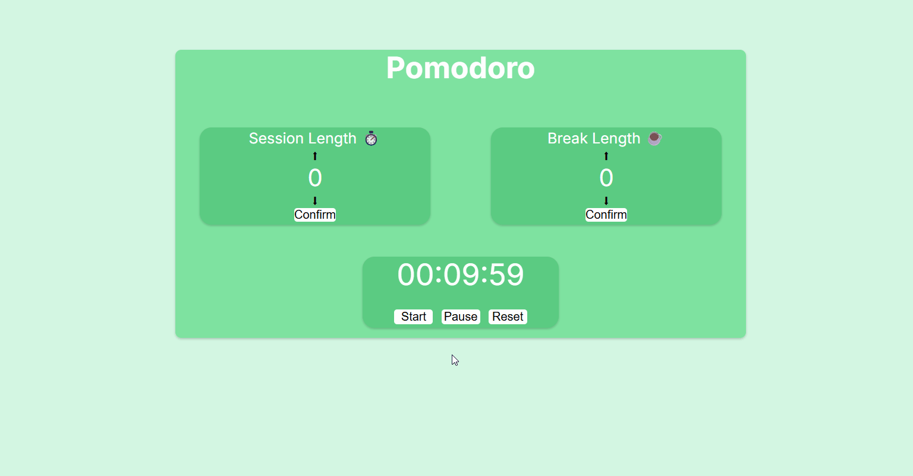
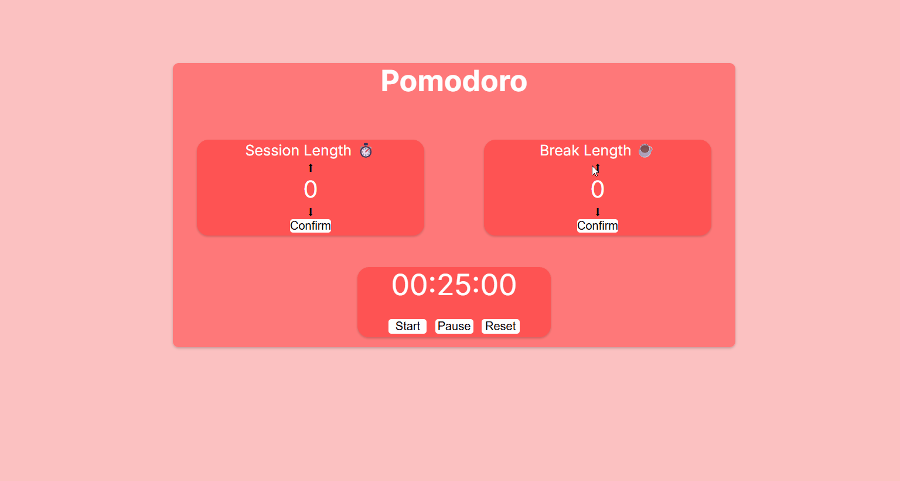

# ⏱️ Pomodoro Clock

Um timer Pomodoro moderno desenvolvido com **HTML**, **CSS** e **JavaScript** contendo:
- Pomodoro Timer (25 min)
- Short Break (5 min)
- Long Break (15 min)
- Pausar, retomar e zerar o tempo
- Sons personalizados para cada evento
- Mudança automática de tema para cada modo
- Suporte a Factory Functions

---

## 🚀 Tecnologias utilizadas

- **HTML5**
- **CSS3**
- **JavaScript (ES6+)**
- **Factory Function Pattern**

---

## 🎯 O que eu aprendi / pratiquei

Projeto criado para estudo e prática de JavaScript, especialmente Factory Functions.

Durante o desenvolvimento deste projeto, aprendi e reforçei conceitos importantes:

### ✔️ **Factory Functions**
Usei o padrão de fábrica para organizar a lógica principal do timer em um objeto com métodos como:
- `startTimer()`
- `pauseTimer()`
- `resumeTimer()`
- `break()`
- `longBreak()`

Isso deixou o código:
- mais organizado,
- mais reutilizável,
- mais fácil de debugar.

### ✔️ Manipulação de tempo com `setInterval`
### ✔️ Eventos DOM (`click`, etc.)
### ✔️ Atualização dinâmica de estilos com CSS Variables
### ✔️ Organização de assets e modularização

---

## Abaixo deixo gifs mostrando customização e funções
Deixei alguns cortados para mostrarem apenas o que importa, para os arquivos não ficarem extensos.

### 🟧Pomodoro Timer (Padrão)

### 🟦 Break (Tempo curto de descanso)

### 🟩 Long Break (Longo tempo de descanso)

### ⬆ Funções da esquerda (Aumentar tempo do timer padrão)

### ⬇ Funções da direita (Aumentar tempo do descanso)

© 2025 • Feito por **Ismael Luis**
